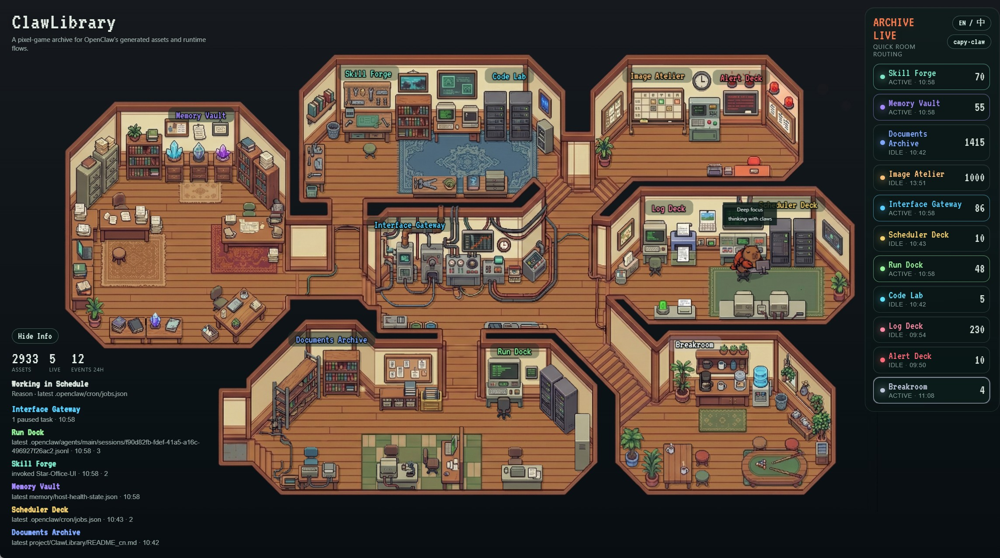

# 龙虾图书馆 / ClawLibrary

- [English README / README.md](./README.md)

龙虾图书馆是一个面向 OpenClaw 的 2D 像素游戏风资产控制室。

它把 OpenClaw 生成出来的大量资产、运行中的访问行为、以及不同资源房间之间的关系，变成一个可浏览、可预览、可实时观察的像素游戏风图书馆界面。



## 项目亮点

- 对 OpenClaw 生成的不同类型资产做分类、索引和管理
- 可以直接在界面里打开和预览这些资产
- 可以实时看到 OpenClaw 正在访问、使用或处理哪一类资源
- 可以把运行状态和具体资产房间关联起来，不再只是看一堆文件夹
- 用更友好的 2D 像素游戏界面呈现整个工作流
- 美术资源可以替换，逻辑层和视觉层可以分离演进

## 它在做什么

龙虾图书馆 / ClawLibrary 会把 OpenClaw 相关资源映射到不同房间，例如：

- 文档归档
- 图像工坊
- 记忆库
- 技能锻炉
- 接口网关
- 代码实验室
- 调度台
- 报警台
- 运行监控
- 队列中枢
- 休息室

整个界面主要回答两个问题：

1. 现在已经有哪些资产？
2. OpenClaw 正在对这些资产做什么？


## 核心功能

- 由 OpenClaw 实时活动驱动的房间路由
- 按 OpenClaw 资源类型划分资产分区
- 可以直接在面板内浏览和预览资产
- 角色移动与房间状态联动
- 提供用于映射和路径检查的调试叠层
- 可替换的像素场景美术资源


## 安装

### 最简单的方法：直接发给 OpenClaw 让它安装

如果对方已经装好了 OpenClaw，最简单的方法就是把仓库地址直接发给它的 OpenClaw，让它帮忙完成安装和启动。

你可以直接发这样一句话：

```text
请帮我安装并启动这个仓库：克隆 https://github.com/shengyu-meng/ClawLibrary 到本地，进入项目目录执行 npm install、npm run validate，然后启动开发服务，并把最终访问地址告诉我。
```

如果你需要局域网访问，可以在这句提示里补一句，要求 OpenClaw 启用局域网访问并返回局域网地址。

### 标准本地启动

```bash
git clone https://github.com/shengyu-meng/ClawLibrary ClawLibrary
cd ClawLibrary
npm install
npm run validate
npm run dev
```

启动后访问：

- 本机访问：`http://127.0.0.1:5173/`
- 如果启用了局域网监听：`http://<你的局域网IP>:5173/`

如果你的 OpenClaw 不在默认路径，优先推荐直接修改：

- `clawlibrary.config.json`

如果你更习惯用环境变量覆盖，也可以复制并填写：

```bash
cp .env.example .env
```

然后设置：

- `OPENCLAW_HOME`
- `OPENCLAW_WORKSPACE`

## 开发命令

```bash
npm run dev
npm run validate
npm run typecheck
npm run build
```

可选 QA 命令：

```bash
npm run qa:movement
npm run qa:visual:baseline
npm run qa:visual
```

这些 QA 命令会在本地生成临时产物；当前默认输出到 `tmp/qa/`，不属于公开仓库内容。

## 运行模型

龙虾图书馆 / ClawLibrary 由协议数据和实时遥测共同驱动：

- `src/data/map.logic.json` — 房间布局、锚点、步行图、工作区域
- `src/data/asset.manifest.json` — 资产逻辑定义
- `src/data/scene-art.manifest.json` — 角色与场景美术绑定
- `src/data/work-output.protocol.json` — 工作状态与输出语义映射
- `scripts/openclaw-telemetry.mjs` — OpenClaw 状态到博物馆实时信号的桥接层

## 配置

龙虾图书馆 / ClawLibrary 现在使用根目录的 `clawlibrary.config.json` 作为公开版配置入口。

当前配置项包括：

- `debug` — 是否显示房间锚点、路径圆圈等调试可视化
- `host` — `127.0.0.1` 表示仅本机访问，`0.0.0.0` 表示允许局域网访问
- `port` — 开发服务端口
- `locale` — `en` 或 `zh`
- `defaultActorVariant` — 默认角色外观

当前仓库默认附带的配置文件：

```json
{
  "openclaw": {
    "home": "",
    "workspace": ""
  },
  "server": {
    "host": "127.0.0.1",
    "port": 5173
  },
  "ui": {
    "defaultLocale": "en",
    "showDebugToggle": false,
    "defaultDebugVisible": false,
    "showInfoToggle": true,
    "defaultInfoPanelVisible": true,
    "showThemeToggle": false
  },
  "actor": {
    "defaultVariantId": "capy-claw-emoji"
  },
  "telemetry": {
    "pollMs": 2500
  }
}
```

辅助文件：

- `.env.example` — 用于展示可选环境变量覆盖
- `scripts/clawlibrary-config.mjs` — 统一读取配置文件与环境变量

## OpenClaw 路径探测

龙虾图书馆 / ClawLibrary 不会写死到某一台电脑的绝对路径。

它当前的策略是：

- 先读取 `clawlibrary.config.json`
- 如果设置了 `OPENCLAW_HOME`，则覆盖配置
- 如果设置了 `OPENCLAW_WORKSPACE`，则覆盖配置
- 如果配置和环境变量都未设置，则默认使用标准 OpenClaw 路径：
  - `~/.openclaw`
  - `~/.openclaw/workspace`

也就是说：

- 对标准 OpenClaw 安装，通常可直接工作
- 对自定义安装路径，可以通过配置或环境变量覆盖


## License

代码采用 MIT License：

- `/LICENSE`

素材采用 CC BY-NC-SA 4.0：

- `/LICENSE-ASSETS.md`
- 允许在署名条件下进行非商用分享、改编和再分发。
- 如果你分发改编后的素材，需要继续使用同样的许可。
- 如果你要将本项目用于商业用途，请替换掉仓库内附带的美术素材，或另行取得原素材授权。

## 鸣谢

- 本项目的界面与方向受到 [Star-Office-UI](https://github.com/ringhyacinth/Star-Office-UI) 的启发。
- 特别鸣谢 [@simonxxooxxoo](https://github.com/simonxxooxxoo) 与 [@ringhyacinth](https://github.com/ringhyacinth)。

## Star History

[](https://www.star-history.com/#shengyu-meng/ClawLibrary&Date)
